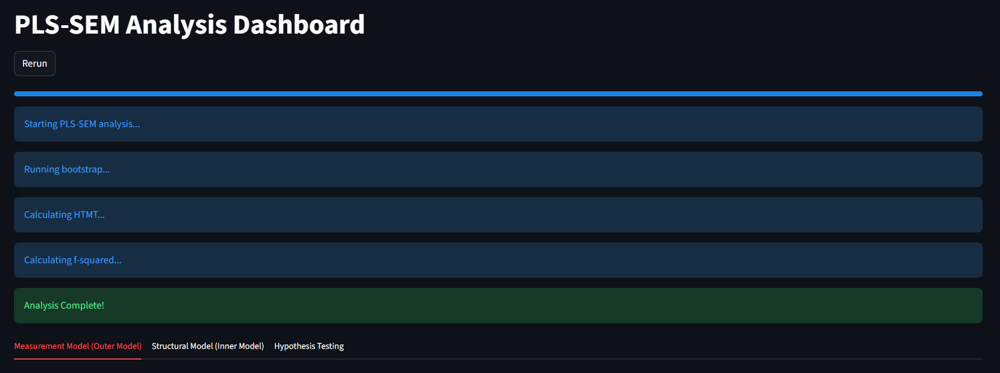
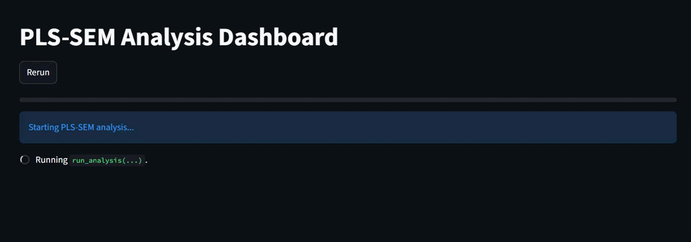

# PLS-SEM With Python

> **WARNING:** All `.csv` files provided in this repository (like `dummy_data.csv`, `cross_loadings_dummy.csv`, etc.) are **dummy data** for demonstration purposes only. Do NOT use them for actual research or reference.

So, long story short: my research did not allow me to use SmartPLS for my research calculations. If you are in the same boat, or you just prefer doing your PLS-SEM using Python, this project is the answer.



## Getting Started

### 1. Setup
First, make sure you have Python installed. Then, grab all the necessary libraries by running:
```bash
pip install -r requirements.txt
```

### 2. Run the App
Once everything is installed, you can start the dashboard (using Streamlit) by running:
```bash
streamlit run sempls.py
```

---

## Configuration

I have made the setup pretty flexible using two main files. Here is how to use them:

### 1. The .env File
This is where you tell the script where your data is and how to handle files.
- DATA_PATH: The path to your dataset (e.g., dummy_data.csv).
- DELIMITER: How your CSV separates data (usually ; or ,).
- CROSS_LOADINGS_CSV, FORNELL_LARCKER_CSV, etc.: File names for saving or loading specific results.

### 2. model_config.yaml
This is the brain of your model. You define your variables here:
- prefixes: If your indicators follow a pattern (like F01_1, F01_2), just list the latent variable name here (e.g., F01).
- explicit: Sometimes, for unknown reasons, certain variables just will not get read correctly using the prefix method. I separated F08 into the explicit category because that was the only way it worked for me at the time. My theory is, If your variable name is only one letter (like `H`), it probably **has** to go here to be read correctly. To be safe, I recommend putting at least one of your variables in this category just to make sure the script doesn't throw a tantrum. If you have a more efficient way to handle this, please feel free to submit a Pull Request.
- structural_paths: Define which variable affects which (e.g., [F01, F09] means F01 predicts F09).
- hypothesis_labels: Give your paths nice names like H1, H2, etc., for the final table.

---

## Customizing Thresholds (Rules)

If you need to change the statistical "rules" (thresholds) to match a specific paper or standard, you can do so easily in `sempls.py`:

### 1. Outer Loadings (0.708)
To change the threshold for the yellow/red coloring in the Outer Loadings table:
- **Location**: Look for the `style_primary_loading` function inside `main()`.
- **Change**: Update `val >= 0.708` to your desired value.

### 2. Hypothesis Testing (P-Value & T-Stat)
To change the significance level (e.g., from 0.05 to 0.01):
- **Location**: Look for the `Keputusan` calculation inside `run_analysis`.
- **Change**: Update `boot_paths['P-Values'] < 0.05` and `boot_paths['t stat.'].abs() > 1.96`. Remember that for a 1% level, the T-Stat is usually `2.58`.

### 3. R-Square Interpretation
To change how R-Square is categorized (Tinggi, Moderat, Lemah):
- **Location**: Look for the `get_r2_keterangan` function inside `main()`.
- **Change**: Adjust the `if/elif` conditions (e.g., changing `0.75` to `0.67`).

### 4. HTMT Gradient
To change the color sensitivity for HTMT:
- **Location**: Look for the `htmt_matrix.round(3).style.background_gradient(...)` line in `main()`.
- **Change**: Update `vmin=0.85` and `vmax=1.0` to adjust the red gradient intensity.

## What is Inside?


This project calculates almost everything you need for a standard PLS-SEM report. All calculations are strictly based on the formulas provided in the images/ folder (like AVE.png, cr.png, and other references in images/dsada).

* Convergent Validity and Reliability: Checks your AVE and Composite Reliability (CR).
* Outer Loadings: Shows how strong each indicator represents its latent variable.
* Discriminant Validity (Cross-Loadings): Ensures indicators belong to their own variables.
* Discriminant Validity (HTMT Ratio): The modern, stricter way to check discriminant validity.
* Prediction Quality (R-Square and Q-Square): How well your model explains and predicts the data.
* Bootstrapping: 5000 iterations to test your hypotheses (P-Values and T-Statistics).

## Documentation

For a deep dive into how the calculations work and how the code is structured, check out:
- [Code Explanation](documentation/code_explanation.md) - Learn how to understand the script structure.
- [Logic & Formulas Explanation](documentation/logic_explanation.md) - Detailed breakdown of the PLS-SEM formulas used in this project.

---

## The SmartPLS Cheat (Limitations)

Currently, Fornell-Larcker Criterion and Model Fit (SRMR, etc.) cannot be calculated directly by this script. 

My current solution: You will need to calculate these two specifically in SmartPLS, export them to .csv, and place them in the project folder (link them in your .env). 

If you have a Python implementation for Fornell-Larcker or Model Fit that works with this setup, please PR it. Let's make this fully independent of SmartPLS.

---

Found a bug? Have a better way to do things? Pull requests are always welcome.
