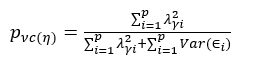
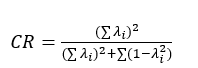
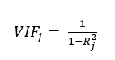
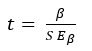
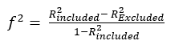
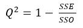

# PLS-SEM Calculation Guide

This guide explains the technical logic behind the calculations in this project. It is designed for collaborators who want to understand how the Python code maps to PLS-SEM theory. Most calculations rely on the `plspm` library, but several metrics (like HTMT, VIF, and Q-Square) are implemented manually to ensure accuracy.

---

## 1. Measurement Model (Outer Model)

### Convergent Validity (AVE)
We use **Average Variance Extracted (AVE)** to check if a latent variable explains more than half of its indicators' variance. 
- **The Rule**: AVE should be > 0.50 (Fornell & Larcker, 1981).
- **The Code**: Calculated automatically by `plspm_calc.inner_summary()['ave']`.
- **Formula**:


### Internal Consistency (Composite Reliability - CR)
CR is preferred over Cronbach’s Alpha because it doesn't assume all indicators have equal weights (Hair et al., 2017).
- **The Rule**: CR should be > 0.70.
- **The Code**: We pull `dillon_goldstein_rho` from `plspm_calc.unidimensionality()`.
- **Formula**:


### Outer Loadings
This shows the correlation between an indicator and its latent variable.
- **The Logic**: Ideally > 0.708 (Hair et al., 2017). In `sempls.py`, we use a helper function `style_primary_loading` to highlight these values in the dashboard (Yellow for valid, Red for weak).

---

## 2. Discriminant Validity

### Cross-Loadings
An indicator should correlate more strongly with its own latent variable than with others.
- **The Code**: We manually compute a correlation matrix between the raw indicator data and the calculated latent variable scores:
  ```python
  correlations = all_data_for_corr.corr().loc[all_indicators, all_lvs]
  ```

### HTMT Ratio (Heterotrait-Monotrait)
HTMT is the modern standard for discriminant validity (Henseler et al., 2015).
- **The Logic**: It calculates the ratio of average correlations between constructs vs. within constructs. 
- **The Code**: See `calculate_htmt(data, mv_map)` in `sempls.py`. It loops through each pair of latent variables, calculates the mean heterotrait correlation and the geometric mean of monotrait correlations.
- **Threshold**: Generally < 0.90 or < 0.85.

---

## 3. Structural Model (Inner Model)

### Collinearity (VIF)
Before testing hypotheses, we check if our predictors are too highly correlated (Multicollinearity).
- **The Rule**: VIF < 5 (Hair et al., 2011).
- **The Code**: Handled by `calculate_indicator_vif`. It runs an OLS regression where one indicator is predicted by all others in the same construct.
- **Formula**:


### Bootstrapping (Hypothesis Testing)
Since PLS-SEM is non-parametric, we use bootstrapping (resampling) to get T-Statistics and P-Values (Hair et al., 2017).
- **The Process**: We run the model 5000 times.
- **The Code**: 
  ```python
  boot_paths['t stat.'] = boot_paths['Original Sample (O)'] / boot_paths['Standard Deviation']
  boot_paths['P-Values'] = 2 * (1 - t.cdf(boot_paths['t stat.'].abs(), df=499))
  ```
- **Formula**:


### Prediction Quality (f-Square)
Measures the "effect size" of a specific path (Cohen, 1988).
- **The Logic**: We compare the $R^2$ of the model with the path included vs. excluded.
- **Formula**:

- **The Code**: We literally re-run the PLS-PM model for every single path while removing that path to calculate $R^2_{excl}$.

### Relevancy (Q-Square)
Measures the predictive relevance of the model using a "Blindfolding" procedure (Stone, 1974; Geisser, 1975).
- **The Code**: Implemented in `calculate_indicator_q2` using `KFold(n_splits=7)`. We omit part of the data, predict it, and calculate the **Sum of Squared Errors (SSE)**.
- **Formula**:



---

*For any questions regarding the implementation, feel free to open an issue or pull request!*
